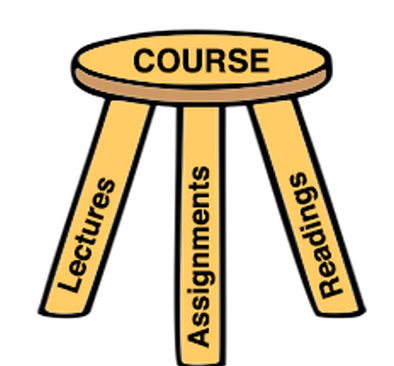

## Content
1. Introduction
2. Course policies
3. Course logistics
4. Grading
5. Final Project
6. Setup Development Environment
7. Q & A

--- .class #id 

## Introduction
- Fullname: Huynh Xuan Phung
- Email:  web.architecture.ute@gmail.com
- Facebook: https://www.facebook.com/web.architecture.ute
- Phone: 0903721836
- Web development: 
     <a href="Certificate1.pdf">Mongodb for Developer</a>  
    <a href="Coursera bigdata 2014.pdf">Web Intelligence and Big data</a>

--- .class #id 

## Course policies (1)

You can expect me:
- To start and end class on time.
- To reply to e-mails within 24 hours on weekdays and 48 hours on weekends.
- To assign homework that adequately covers the material and meets the learning objectives of the course while adhering to the time expectations for units course.

---

## Course policies (2)

I can expect you:
- To come to class on time.
- To be attentive and engaged in class.
- To utilize your laptop for practicing lectures only.
- To spend an adequate amount of time on the homework each week, making an effort to solve and understand each problem.
- To seek help when appropriate.

---

## Course logistics

---

## Outline

<a href="04_DCCT_CTDT150_LapTrinhWeb.pdf">Web programming</a>
---

## Syllabus

Module 0. Innovation and Prototype - HCI approach 
Module 1. Introduction and Background 
Module 2. .NET framework and ASP.NET 
Module 3. Database Interaction 
Module 4. C# language 
Module 5. Middleware 
Module 6. Presentation/ User Interface 

---

## Grading

1. Questions: 30%
2. Assignment: 30%
3. Finall project: 40%
4. Bonus marks

---

## Final project

- Each student must involve an appropriate project
- ASP.NET must be utilized to implement the project
- Some projects that are qualitative will be chosen for students' research presentation
- Project must acquire the Design Briefs

  <a href="Wiki - Design Briefs _ Coursera.htm">Design Briefs</a>

---

## Design Briefs

There are three design briefs for you to pick from. Your project for this course should address ONE of these concepts. (If you really feel like you need to have a blend, that's fine, but pick a 'main' brief for the purposes of peer grading.) Use a design brief to help you find an interesting idea for your course project!

---

## Design Briefs

### Glance
1. Project Brief

We are surrounded by information. Some might even call it overload. How might technology show us the essential pieces at a glance, so we can quickly navigate through the noise to get to what we really want? We compulsively check email, Twitter, Facebook, and the news --- just in case there's something there. Right now we are doing the filtering and finding ourselves, why not let our devices do it for us? How can a screen summarize information and present just the most relevant parts (especially if it is tiny)? How can these devices use social and physical context to more effectively have the key information ready at a glance? Today the home screen of many devices is a grid of icons, or a static picture. That's not very creative. You can do way better!

---

### Glance
2. Your Mission

Find people and design a personal dashboard tailored to their needs.

---

### Glance
3. Design Inspiration

- What should a dashboard display? Email, calendar, news, time, weather, reminders? Which ones? All of them? Or maybe a screen that just has a short note from a loved one. Which is better? It all depends on who you're designing for.
- What might a context-aware dashboard look like? Could time, location, or who is nearby help a device create a more effective glance?
- What might a 10x10 pixel screen show? The mood of a friend? The state of the stock market? How much it snowed in Tahoe? Whether the coffee in this shop is fair trade?
- What are the differences between the display of a wall in a room and a mobile screen? Benefits, drawbacks?
- How might we use ambient alerts to convey information?
- What would the dashboard of Albert Einstein look like? Or Lady Gaga? President Obama?

---

### Glance
 
Design Inspiration

- How might we "grab that moment", catch the last five seconds said, or visually capture that which no one else saw?
- How might we send a message with one gesture?
- What might appropriate alerts look like? What if you were only interrupted when you should be, or only some interruptions got through, or the interruption interaction was context-aware?

---

### Glance

4. Example:

- <a href="http://www.google.com/landing/now/">Google Now</a> - A personal assistant app that manages your day based on search habits
- Speed reading <a href="https://chrome.google.com/webstore/detail/spreed-speed-read-the-web/ipikiaejjblmdopojhpejjmbedhlibno?hl=en-US">apps - Spreed </a>, <a href="http://www.spritzinc.com/">Spritz</a>
- <a href="https://www.apple.com/downloads/dashboard/">Apple's Dashboard Widgets</a>

---

## Design Briefs

### Time
1. Project Brief

The way people represent time changes how they think about it. Wall calendars remind us of years, seasons, and the dentist appointment 6 months in the future. They codify weeks by wrapping every seven days, and it's easy to find the weekends -- they are on the edges. Clocks help us coordinate with others. Historically, many countries' citizens adopted pocket watches and clocks along with the railroad. Before the railroad, there was no need for precise time. Daily schedules help us plan. They can encourage us to "fill" our days, or talk about being "free". When we punch the clock, or bill hours, we turn time into money. These representations are human inventions. Most digital time representations --- clocks, daily and monthly calendars, ... --- simply translate paper and gears into pixels and beeps. With the computation and sensing capabilities of mobile devices, can we find a more personal and joyful way to interact with time?

---

## Time

2. Your Mission

Redesign the way we experience or interact with time.

---

## Time

3. Design Inspiration

- The American Institute of Health estimates that 75-90% of all visits to primary care physicians are stress related. Could an interactive time representation help us be effective and relaxed?
- What if our mobiles were aware of our daily rhythm and helped us reschedule our activities to optimize for our well-being? How could we redesign the alarm clock? Do alarms need to be obnoxious? Maybe an alarm clock could wake us with the smell of delicious breakfast, or coffee? Or maybe its sensing could pay attention to our circadean rhythms, and wake us at an appropriate time? Could a time representation help us get a good night's sleep?

---

## Time

- How might a design use multiple modalities --- visual, auditory, vibration, ... --- selectively or in concert to create more effective reminders?
- How might we help people feel happy and energetic --- when they wake up and throughout the day? What if instead of a clock calendar we had an energy calendar? So that instead of scheduling for 2 in the afternoon, one schedules for "when I'm feeling energetic", "when it's nice outside", or "when it's quiet".
- How might we leverage technology to feel more in touch with our temporal rhythms?
- How might we create a new representation of time?
- How can we create better social representations of time?

---

## Time

4. Here are a few cool examples:

- <a href="http://techcrunch.com/2013/10/10/tikker-is-a-watch-that-counts-down-to-your-death-because-yolo/">Tikker</a> - A watch that counts down to your death. How's that for redesigning the way you experience time?
- <a href="http://www.qlocktwo.com/">QLOCKTWO by Biegert & Funk</a>
- <a href="http://www.sleepcycle.com/">Sleep Cycle</a>

---

## Design Briefs

### Change
1. Project Brief

Change is hard. Sometimes we lack information. Other times, our routines and habits are really persistent, even if we wish they weren't. Can technology help people and communities change their behavior to meet their goals? Electronic devices (computers, phones, tablets...) can help by providing information. By reminding us. And by connecting us with others. Change might mean exercising more, eating healthier, helping make a more sustainable planet, or participating in local government. Or it might be becoming a better chess player, carving out time to read, or remembering to see the world from a new perspective. How can we recognize when change needs to occur and determine appropriate goals? What methods can be effective in triggering and maintaining change?

---

## Change

2. Your Mission

Design an interface that facilitates personal or social behavior change.

---

## Change

3. Design Inspiration

- How do people kick undesired habits and build desired ones? What role does being aware of these undesired habits play in building desired ones?
- What role could incentivizing people have in nudging them in a certain direction?
- How can technology monitor personal health? How can health status be conveyed to people to lead to better health?

---

## Change

- Can technology provide a window onto the environmental and labor practices behind products? Or steer people toward decisions that align with their values?
- How might technology help people understand how sustainable their decisions are and make better decisions? Like buying local food, using less energy, avoiding cars, and reusing rather than buying new?
- How might interfaces increase mindfulness?
- What's the most effective way to join people together to help a cause?

---

## Change

4. Examples:

- <a href="http://www.carbonstory.org/">CarbonStory</a> is a crowdfunding site for climate change projects that uses gamification techniques to engage users.
- <a href="https://instead.com/">Instead</a> encourages small lifestyle changes to save money that can be instead be donated to non-profits.
- <a href="http://www.fitbit.com/premium/about">Fitbit</a> uses reports to recommend health targets and peer comparison to increase motivation towards wellness goals.

---

## Change

- <a href="http://www.thebudge.com/">Budge</a> lets friends challenge each other to anything and the loser donates to a charity.
- <a href="http://iamfutureproof.com/tools/awareness/">Awareness</a> plays the sound of a Tibetan singing bowl after every hour of continuous computer use as subtle awareness that will not "nag you or force you to stop using your computer."
- <a href="http://www.quitnow.ca/">Quitnow</a> provides educational resources, expert coaches, and interaction with community members also trying to quit smoking.A <a href="http://news.psu.edu/story/314757/2014/05/06/research/mobile-health-apps-lack-behavior-change-techniques">research study</a> on the extent to which mobile apps use behavior-change techniques.
